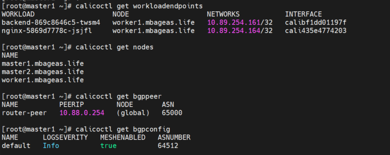
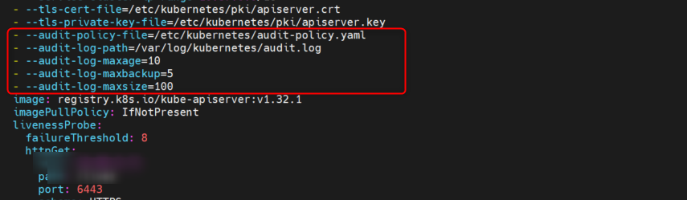
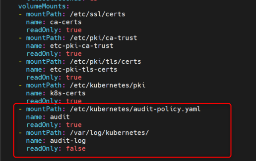
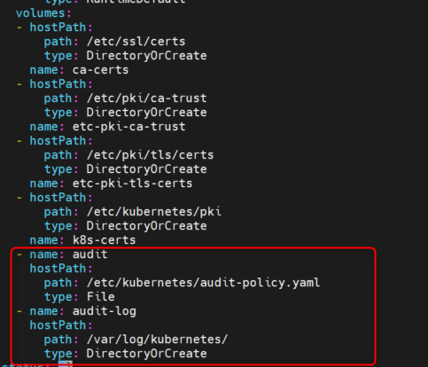

### Deploy Calico with BGP
    
    wget https://raw.githubusercontent.com/projectcalico/calico/v3.29.3/manifests/calico.yaml
    kubectl apply -f calico.yaml

#### kiểm tra calico image version

    kubectl describe daemonset.apps/calico-node -n kube-system | grep Image

#### tải calicoctl as a binary về master node

    curl -L https://github.com/projectcalico/calico/releases/download/v3.29.3/calicoctl-linux-amd64 -o calicoctl
    chmod +x calicoctl && mv /usr/local/sbin/
******_chú ý: phiên bản image và phiên bản binary phải giống này_******

    calicoctl apply -f bgp-configuration.yaml
    calicoctl apply -f bgp-peer.yaml
    calicoctl version
    calicoctl get nodes
    calicoctl get workloadendpoints
    calicoctl get bgppeer
    calicoctl get bgpconfig

By default, calicoctl will attempt to read from the Kubernetes API using the default kubeconfig located at $(HOME)/.kube/config.

Trường hợp thực hiện lệnh lỗi cần sử dụng env

    export DATASTORE_TYPE=kubernetes
    export KUBECONFIG=~/.kube/config

refer: https://docs.tigera.io/calico/latest/operations/calicoctl/configure/kdd

### Deploy metallb Layer 2 (ARP) Do không có DHCP Server

    kubectl apply -f metallb-native.yaml
    kubectl apply -f metallb-config.yaml

### Deploy Envoy Gateway

    helm install eg oci://docker.io/envoyproxy/gateway-helm --version v0.0.0-latest -n envoy-gateway-system --create-namespace
    kubectl wait --timeout=5m -n envoy-gateway-system deployment/envoy-gateway --for=condition=Available
    kubectl get crds | grep gateway

### Deploy Gateway Class
    
    kubectl apply -f GatewayClass.yaml
    kubectl apply -f Gateway.yaml

### Test

    kubectl create deploy nginx --image=nginx
    kubectl expose deploy nginx --port 80 --type LoadBalancer/ClusterIP
    kubectl apply -f HTTPRoute-Nginx.yaml

### enable audit logs 

    cat > /etc/kubernetes/audit-policy.yamla <<EOF
    apiVersion: audit.k8s.io/v1
    kind: Policy
    rules:
      - level: Metadata
        resources: [{"group": "", "resources": ["secrets"]}]
      - level: RequestResponse
        resources: [{"group": "", "resources": ["configmaps"]}]
      - level: Metadata
        verbs: ["delete", "create", "update"]
      - level: Request
        userGroups: ["system:anonymous"]

    EOF

    vim /etc/kubernetes/manifests/kube-apiserver.yaml

***Insert to command parameters***

    - --audit-policy-file=/etc/kubernetes/audit-policy.yaml
    - --audit-log-path=/var/log/kubernetes/audit.log
    - --audit-log-maxage=10
    - --audit-log-maxbackup=5
    - --audit-log-maxsize=100

***Insert to volumeMounts***

    - mountPath: /etc/kubernetes/audit-policy.yaml
      name: audit
      readOnly: true
    - mountPath: /var/log/kubernetes/
      name: audit-log
      readOnly: false

***Insert to volumes***

    - name: audit
      hostPath:
        path: /etc/kubernetes/audit-policy.yaml
        type: File
    - name: audit-log
      hostPath:
        path: /var/log/kubernetes/
        type: DirectoryOrCreate

### Create k8s folder logs 

    mkdir /var/log/kubernetes/
    touch /var/log/kubernetes/audit.log

***restart kube-apiserver pod***