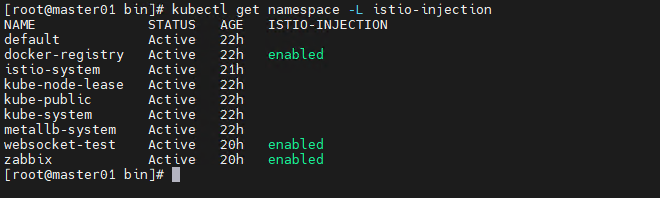
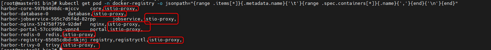
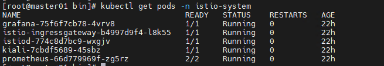
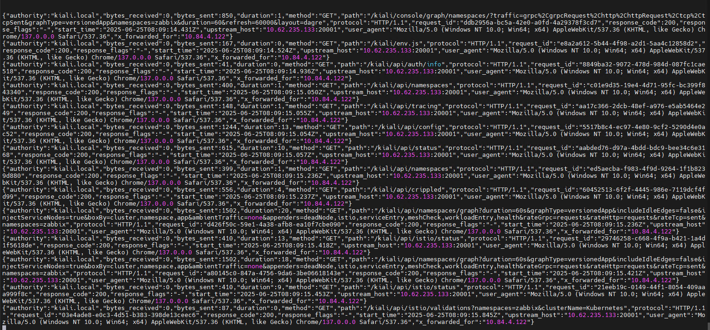
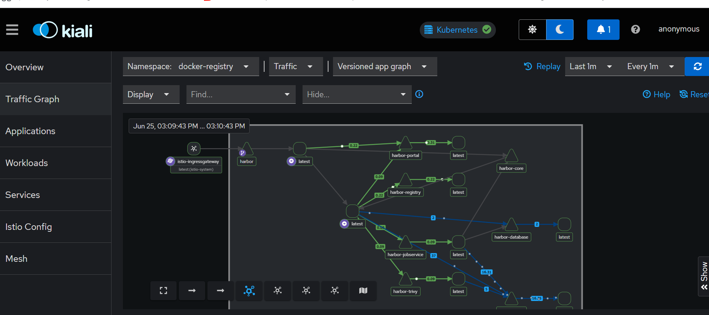

#### Install

    curl -L https://istio.io/downloadIstio | sh -
    cd istio-1.*
    export PATH=$PWD/bin:$PATH
Or

    cd istio-1.*  && cd bin && cp istioctl /usr/local/sbin

##### check version 
    istioctl version
#### check env
    istioctl x precheck

### Install Istio Control plane
    istioctl install --set profile=default -y
#### check Pods
    kubectl get pods -n istio-system
#### Enable auto-injection for sidecar on namespaces
    kubectl label namespace <your-namespace> istio-injection=enabled

###### Caution: Don't enable istio-injection=enabled on kube-system, istio-system namespace

#### check namespace
    kubectl get namespace -L istio-injection

####### If want enable all namespaces

        for ns in $(kubectl get ns --no-headers | awk '{print $1}' | grep -vE 'kube-system|kube-public|istio-system'); do
            kubectl label namespace $ns istio-injection=enabled --overwrite
        done

#### We need rollout restart statefulset, deployment or replicaset
    kubectl rollout restart deployment -n <your-namespace>
Or
    
    kubectl delete pod --all -n <your-namespace>
#### Check pods lable
    kubectl get pod -n <your-namespace> -o jsonpath="{range .items[*]}{.metadata.name}{'\t'}{range .spec.containers[*]}{.name}{','}{end}{'\n'}{end}"

#### Check MutatingWebhook if don't still inject
    kubectl get mutatingwebhookconfiguration
    kubectl logs -n istio-system deployment/istio-sidecar-injector

##### Caution: 
- Pod only inject when new create > if pods existed need rollout or recreate
- Istio can't auto-inject to DaemonSet / Job / CronJob > You need inject manual
- Shouldn't inject special namespace as a kube-system, istio-system

___
#### Enable addons
    cd istio-1.*
    kubectl apply -f samples/addons/kiali.yaml
    kubectl apply -f samples/addons/prometheus.yaml
    kubectl apply -f samples/addons/grafana.yaml
    kubectl get pods -n istio-system

---
### Create a test application
    kubectl create ns bookinfo
    kubectl label namespace bookinfo istio-injection=enabled
    kubectl apply -f samples/bookinfo/platform/kube/bookinfo.yaml -n bookinfo
    kubectl apply -f samples/bookinfo/networking/bookinfo-gateway.yaml -n bookinfo

    kubectl get services -n bookinfo
    kubectl get pods -n bookinfo

---

### Create share-gateway

- Default each namespace need a gateway for virtualservice.

    kubectl apply -f shared-gateway.yaml
#### Create virtualservice

    kubectl apply -f vir_kiali.yaml

#### custom log's gateway

    kubectl apply -f Istios_format_log.yaml

